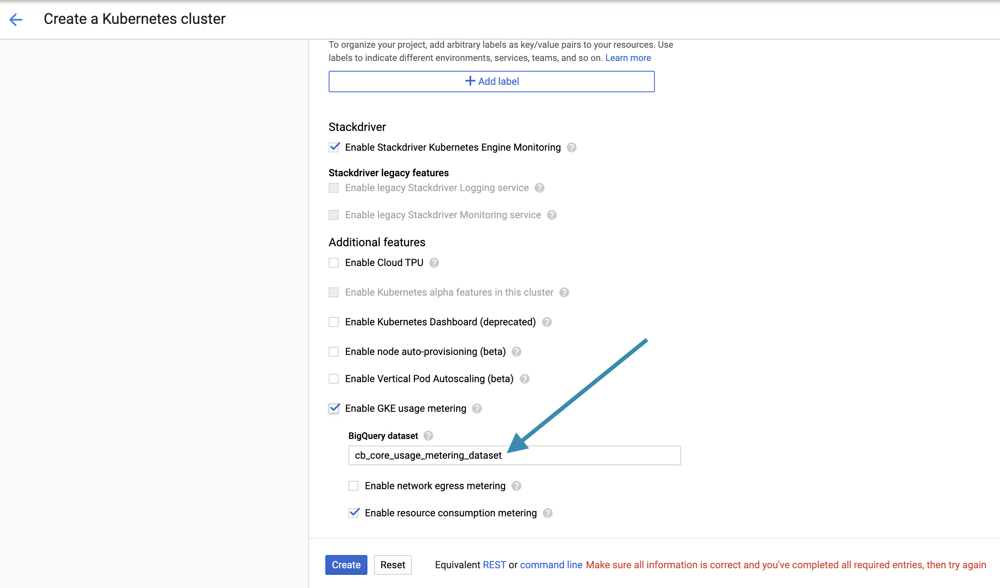
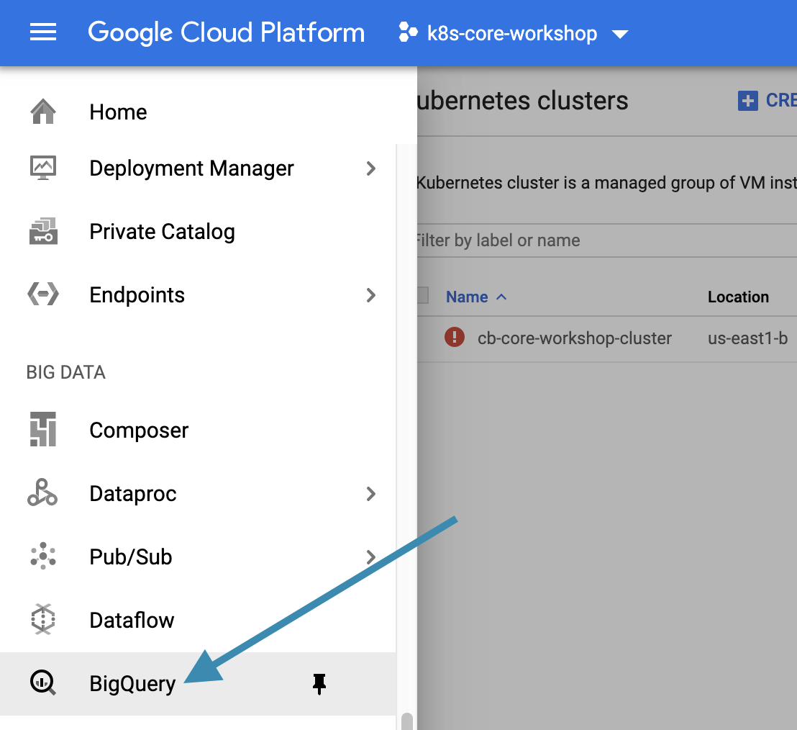
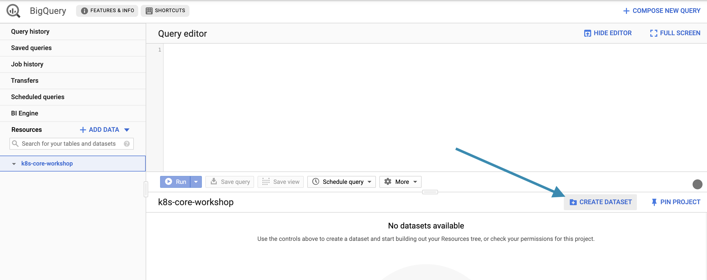
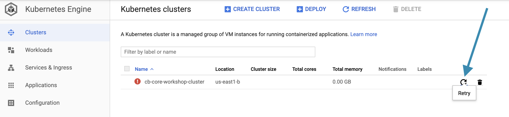

# Getting Started

## Overview
- Create a GitHub Organization for managing all lab configuration as code
- Create a Google Cloud Platform (GCP) Project
- Create a Google Kubernetes Engine (GKE) Cluster
- Open a Google Cloud Shell workspace and connect to GKE cluster

## Create GitHub Organization and Repository

We will use a GitHub repository to store all of the configuration for our CloudBees Core environments as code.

### Create a GitHub Organization for the Workshop

Creating a new GitHub Organization will allow you to easily identify the repositories that are specific to this workshop, and will allow easy clean-up once you are done.

1. If not already signed in, sign in to [GitHub](github.com)

### Create a GitHub Repository for CloudBees Core Install Configuration

1. From the GitHub Organization you created above create a new repository named **oc-casc**
2. For the repository description enter ***Configuration as code for CloudBees Core Operations Center on Kubernetes***
3. Initialize with **README.md**

## Create a GCP Project

### Why Google Cloud?
For the purposes of this workshop, the Google Cloud Platform provides the best tools and functionality with ease of use for managed Kubernetes. Where applicable, key differences between GKE, EKS and AKS will be noted and explained.

## Create a GKE Cluster

1. In the GCP console - within the GPC project you created for this workshop - navigate to **Compute > Kubernetes Engine** and click on ***Clusters*** <p>
2. On the **Kubernetes Engine > Clusters** screen click on the ***Create cluster*** button <p>
3. On the **Create a Kubernetes cluster** screen:
   1. Update **Name** to ***cb-core-workshop-cluster***
   2. Leave **Location type** set to ***Zonal***
   3. Select a **Zone** that is geographically closest, for example ***us-east1-b*** for Richmond, VA
   4. Under **Master version** click the version drop-down and select ***1.14.6-gke.2***  <p>
   5. Under **Node pools** click on the **More options** button <p>
   6. On the **Edit node pool** screen:
      1. Change the **Name** to ***cb-core-node-pool***
      2. Under **Size** set the number of nodes to 1, then check the **Enable autoscaling** checkbox and then set **Minimum number of nodes** to 0 and **Maximum number of Nodes** to 3
      3. Under **Nodes** select ***Container-Optimized OS with Containerd (cos_containerd) (beta)*** for the **Image type**
      4. Under **Machine configuration** select ***n1-standard-2 (2 vCPU, 7.5 GB memory)*** as the **Machine type**
      5. Select ***SSD persistent disk** as the **Boot disk type**
      6. Under **Shielded options** check the ***Secure boot*** checkbox
      7. Under **Metadata > Kubernetes labels** click the **Add label** button and add a label with a **Key** of ***workload*** and a **Value** of ***general*** <p>
      8. Click on the **Save** button at the bottom of the screen
   7. Back on the **Create a Kubernetes cluster** screen scroll down to and click **Availability, networking, security, and additional features**
   8. Under **Security** check the **Enable Workload Identity (beta)** checkbox
   9. Under **Stackdriver** check the **Enable Stackdriver Kubernetes Engine Monitoring** checkbox if it isn't already checked
   10. Under **Additional features** check the **Enable GKE usage monitoring** checkbox and enter ***cb_core_usage_metering_dataset*** for the name of the **BigQuery dataset**
   11. Review your configuration and then click the **Create** button at the bottom of the screen <p>
4.  The cluster won't be created because we don't have a BigQuery dataset so we will create a ***cb_core_usage_metering_dataset*** BigQuery dataset
    1.  From the top left menu, navigate to and select **BIG DATA > BigQuery** <p>
    2.  On the **BigQuery** screen click on **CREATE DATASET** <p>
    3.  On the **Create dataset** screen enter ***cb_core_usage_metering_dataset*** as the **Dataset ID** and then click the **Create dataset** button at the bottom of the screen
5.  Navigate back to **Compute > Kubernetes Engine > Clusters** and click on the **Retry** button <p>
6.  Your GKE cluster should begin to be created - **note that this will take several minutes**

### What have we done so far?
We have created a GKE cluster with the following features:

-  We enabled [Cluster Autoscaling](https://cloud.google.com/kubernetes-engine/docs/how-to/cluster-autoscaler) to allow are cluster to scale from 0 to 3 nodes depending on the workload. In later labs we will see how this provides CD scalability and cost savings for both Core Managed Masters and ephemeral Jenkins Kubernetes Agents.
  >NOTE: While GCP makes it very easy to enable and use cluster autoscaling it does not allow you to modify the [Cluster Autoscaler](https://github.com/kubernetes/autoscaler/tree/master/cluster-autoscaler) configuration such as [the amount of time the Cluster Autoscaler waits to scale down when there is an unneeded node](https://github.com/kubernetes/autoscaler/blob/master/cluster-autoscaler/FAQ.md#i-have-a-couple-of-nodes-with-low-utilization-but-they-are-not-scaled-down-why) - the default value is 10 minutes and this cannot be modified when using the built-in Cluster Autoscaler for GKE
-   We used [Containerd](https://cloud.google.com/kubernetes-engine/docs/concepts/using-containerd) as our node pool image type to [provide better performance](https://kubernetes.io/blog/2018/05/24/kubernetes-containerd-integration-goes-ga/) and additional security for CloudBees Core CD workloads 
- We added a Kubernetes label to the node pool we created so that we can target different node pools for different CloudBees Core CD workloads. We only have one node pool right now - that we will use for CloudBees Core and general Jenkins Kubernetes agent workloads - but we will be adding another node pool for more specific workloads in another lab.
-  We enabled GKE **Workload Identity** and in a later lab we will see how this provides a more secure way of interacting with other GCP services (like GCR) from Jenkins Kubernetes agent Pods
- We enabled **GKE usage monitoring** to provide more detailed monitory to track costs of our cluster resources down to the Kubernetes Namespace level

## Google Cloud Shell Workspace
A Cloud Shell workspace will provide all of the tools that we will need for the steps in the rest of the labs, to include:

- `gcloud` SDK installed and configured
- `kubectl` for interacting with your GKE cluster
- `git` for managing all of the configuration for the labs as code in GitHub

### Open Google Cloud Shell and connect to your cluster

1. Navigate to the **Compute > Kubernetes Engine > Clusters** screen and click on the **Connect** button <p>
2. On the **Connect to the cluster** screen click on the **Run in Cloud Shell** button <p>
3. The Google Cloud Shell will open with a `gcloud` command (for example: `gcloud container clusters get-credentials cb-core-workshop-cluster --zone us-east1-b --project k8s-core-workshop`) to connect to your GKE cluster, just hit ***return** on your keyboard
4. Now we will run a `kubectl` command to see what Pods are running in our cluster

    ```shell
    kubectl get pods --all-namespaces
    ```
5. This will return a list of Kubernetes Pods similar to the following - also note that the **NAMESPACE** for all the Pods is `kube-system` - in the next lab we will create a new Kubernetes Namespace for the CloudBees Core install
   
   ```
   kmadel@cs-6000-devshell-vm-5723798c-973c-4cf7-9ae4-4fea79c7a8f6:~$ kubectl get pods --all-namespaces
   NAMESPACE     NAME                                                             READY   STATUS    RESTARTS   AGE
   kube-system   event-exporter-v0.2.5-7df89f4b8f-vc5q4                           2/2     Running   0          2m32s
   kube-system   fluentd-gcp-scaler-54ccb89d5-7flnn                               1/1     Running   0          2m28s
   kube-system   fluentd-gcp-v3.1.1-2222z                                         2/2     Running   0          2m4s
   kube-system   gke-metadata-server-dl9tx                                        1/1     Running   0          2m21s
   kube-system   heapster-v1.7.0-dbfbcf8c9-lb76x                                  3/3     Running   0          96s
   kube-system   kube-dns-5877696fb4-j98gk                                        4/4     Running   0          2m33s
   kube-system   kube-dns-autoscaler-57d56b4f56-jgcj8                             1/1     Running   0          2m27s
   kube-system   kube-proxy-gke-cb-core-workshop-cb-core-node-poo-9e534095-svb8   1/1     Running   0          2m20s
   kube-system   l7-default-backend-8f479dd9-qd2t5                                1/1     Running   0          2m33s
   kube-system   metrics-server-v0.3.1-8d4c5db46-hzhbj                            2/2     Running   0          2m
   kube-system   netd-m2lbw                                                       1/1     Running   0          2m21s
   kube-system   prometheus-to-sd-dhpsc                                           1/1     Running   0          2m11s
   kube-system   stackdriver-metadata-agent-cluster-level-6dc64b4bbc-pbc9k        1/1     Running   0          2m32s
   ```

## Lab Summary
In this lab we created a GKE cluster. In the next lab we will install CloudBees Core on this cluster.


