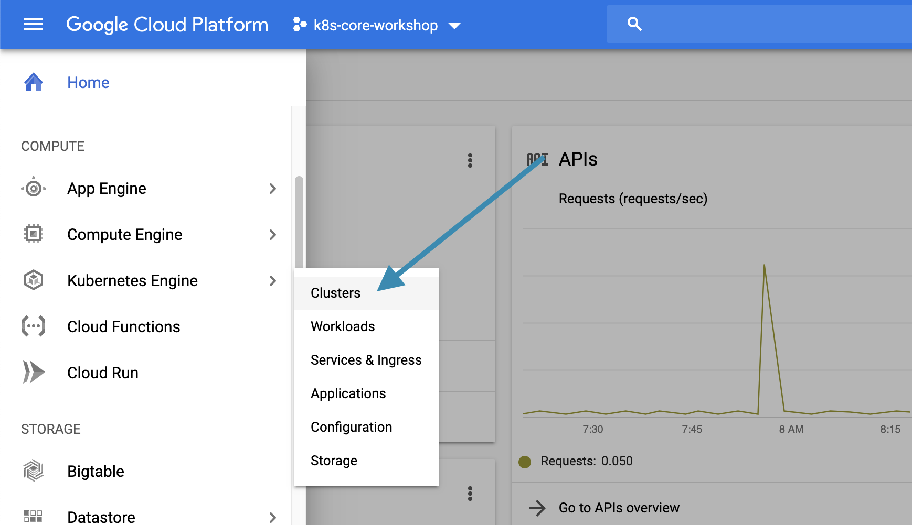
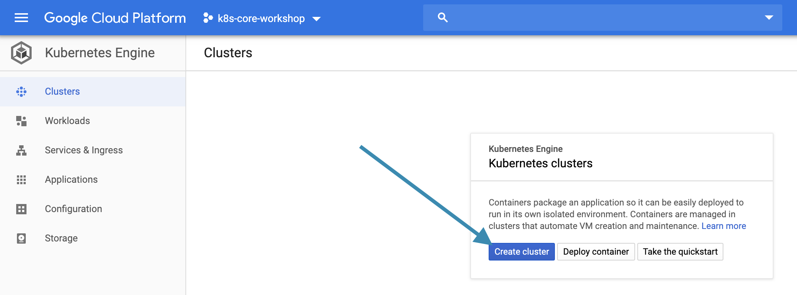
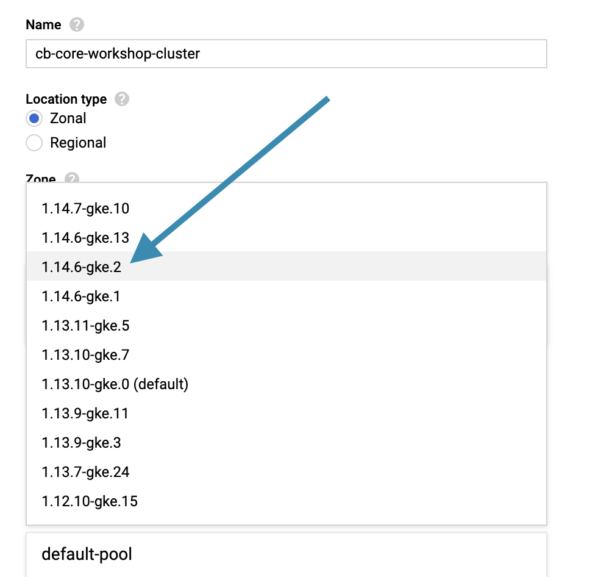
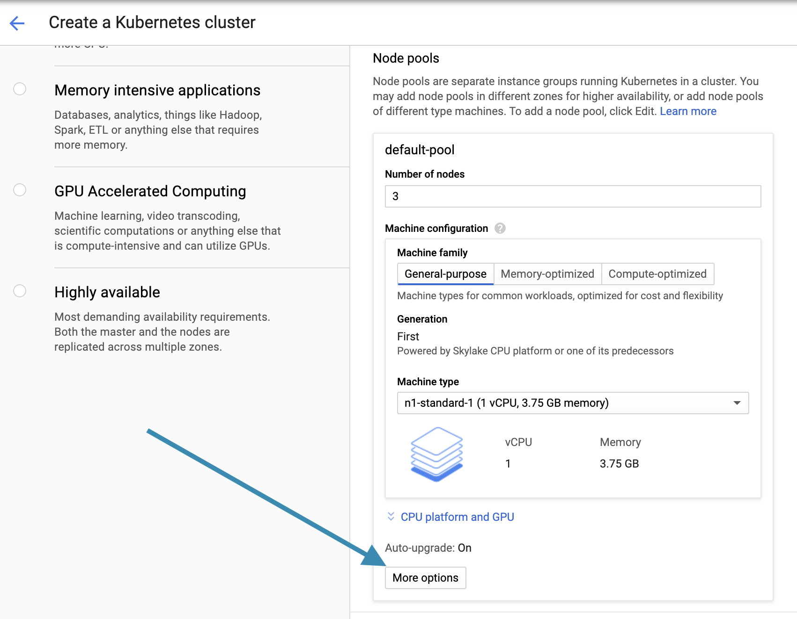
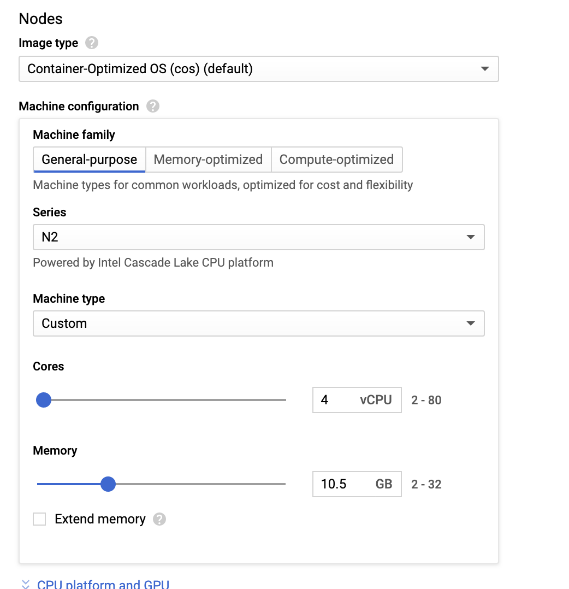
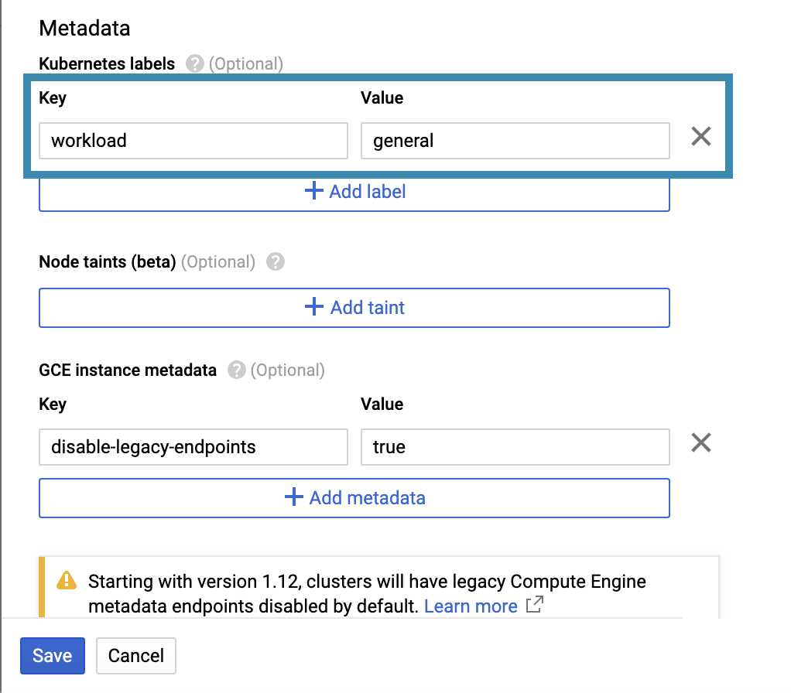
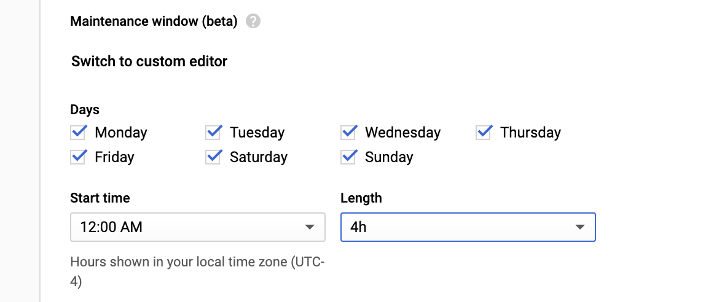
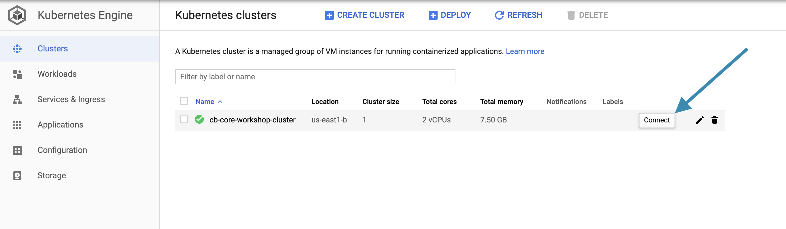
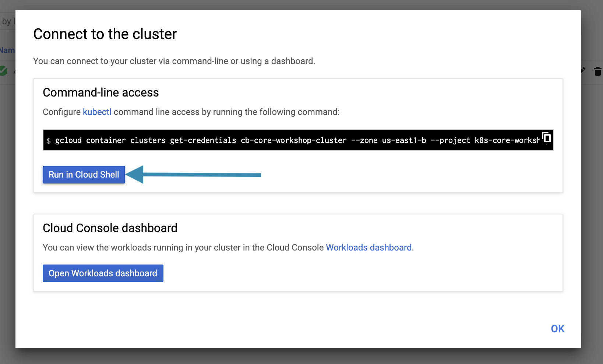

# Getting Started - Creating a Highly Available Regional GKE Cluster 

## Overview
- Create a GitHub Organization for managing all lab configuration as code
- Create a Google Cloud Platform (GCP) Project
- Create a Regional (multiple Zones) Google Kubernetes Engine (GKE) Cluster
- Open a Google Cloud Shell workspace and connect to GKE cluster

## Create GitHub Organization and Repository

We will use a GitHub repository to store all of the configuration for our CloudBees Core environments as code. A fundamental best practice for Core is to manage all configuration as code in source control.

### Create a GitHub Organization for the Workshop

Creating a new GitHub Organization will allow you to easily identify the repositories that are specific to this workshop, and will allow easy clean-up once you are done.

1. If not already signed in, sign in to [GitHub](github.com)

### Create a GitHub Repository for CloudBees Core Install Configuration

1. From the GitHub Organization you created above create a new repository named **oc-casc**
2. For the repository description enter ***Configuration as code for CloudBees Core Operations Center on Kubernetes***
3. Initialize with **README.md**

## Create a GCP Project

### Why Google Cloud?
For the purposes of this workshop, the Google Cloud Platform provides the best tools and functionality with ease of use for managed Kubernetes. Where applicable, key differences between GKE, EKS and AKS will be noted and explained.

## Create a GKE Cluster

1. In the GCP console - within the GPC project you created for this workshop - navigate to **Compute > Kubernetes Engine** and click on ***Clusters*** <p>
2. On the **Kubernetes Engine > Clusters** screen click on the ***Create cluster*** button <p>
3. On the **Create a Kubernetes cluster** screen:
   1. Set the **Location type** to ***Regional***
   2. Select a **Region** that is geographically closest and has N2 machine types available, for example ***us-central1*** for Richmond, VA
   >NOTE: [GKE supports three types of locations for clusters](https://cloud.google.com/kubernetes-engine/docs/concepts/types-of-clusters): single-zone clusters, multi-zonal clusters and regional clusters. Regional clusters provide the most availability and single-zone clusters provide the least, while regional clusters will be the most expensive to run and single-zone clusters will be the least expensive.
   1. Under **Master version** click the version drop-down and select ***1.14.7-gke14***  <p>
   2. Under **Node pools** click on the **More options** button <p>
   3. On the **Edit node pool** screen:
      1. Under **Size** set the number of nodes to 1, then check the **Enable autoscaling** checkbox and then set **Minimum number of nodes** to **0** and **Maximum number of Nodes** to **2**
        >NOTE: Autoscaling will provide dynamic scalability for when your workload increases while also reducing costs when your workload decreases and less nodes are needed. Autoscaling for GKE is based on the [Kubernetes cluster-autoscaler project](https://github.com/kubernetes/autoscaler/tree/master/cluster-autoscaler) but it is not configurable when using the managed GKE autoscaler. One aspect of the configuration for the cluster-autoscaler is `--scale-down-unneeded-time` that controls how much time the cluster-autoscaler waits when it identifies that a node can be scale down - the default value is **10 minutes** and this cannot be changed when using the GKE autoscaler. If you would like to set a lower threshold then you would have to manual install and manage the cluster-autoscaler on worker nodes (by default, the cluster-autoscale is installed on master nodes).
      2. Under **Machine configuration** select ***N2*** as the **Series** and ***Custom*** as the **Machine type**. For the custom settings configure **4** **Cores** and **10.5 GB** of **Memory**. A typical Core Managed Master is configure to use **3 GB** of memory, so these settings will allow there to be 3 Managed Masters on one node. <p>
      3. Select ***SSD persistent disk** as the **Boot disk type**
        >NOTE: SSD will provide quicker boot times for nodes when they are scale up with autoscaling.
      4. Set the **Boot disk sic (GB)** to ***50***.
      5. Under **Metadata > Kubernetes labels** click the **Add label** button and add a label with a **Key** of ***workload*** and a **Value** of ***general*** <p>
      6. Click on the **Save** button at the bottom of the screen
   4. Back on the **Create a Kubernetes cluster** screen scroll down to and click **Availability, networking, security, and additional features**
   5. Under **Availability** check the ***Manually select node locations*** checkbox and then select only two zones - for example ***us-central1-c*** and ***us-central1-f*** (do not select us-central1-b as it does not have N2 machine types)
   >NOTE: By default a regional cluster will use 3 zones, but to minimize costs for the workshop we will only select two - resulting in less availability than the default but still provide multi-zone failover.
   1.  Check the box for **Enable Workload Identity (beta)**. We will learn more about Workload Identity for GKE in the lab on Jenkins Pipelines and Pod Templates.
   2.  Under **Maintenance window (beta)** select ***12:00 AM*** as the **Start time** and ***4h*** as the **Length** - we don't want our clusters restarting for an upgrade during the workshop <p>
   3.  Under **Stackdriver** check the **Enable Stackdriver Kubernetes Engine Monitoring** checkbox if it isn't already checked
   4.  Review your configuration and then click the **Create** button at the bottom of the screen.
4.  Your GKE cluster should begin to be created - **note that this will take several minutes**

### What have we done so far?
We have created a GKE cluster following several best practices:

-  We created a regional GKE cluster across tow 
-  We enabled [Cluster Autoscaling](https://cloud.google.com/kubernetes-engine/docs/how-to/cluster-autoscaler) to allow are cluster to scale from 0 to 3 nodes depending on the workload. In later labs we will see how this provides CD scalability and cost savings for both Core Managed Masters and ephemeral Jenkins Kubernetes Agents.
  >NOTE: While GCP makes it very easy to enable and use cluster autoscaling it does not allow you to modify the [Cluster Autoscaler](https://github.com/kubernetes/autoscaler/tree/master/cluster-autoscaler) configuration such as [the amount of time the Cluster Autoscaler waits to scale down when there is an unneeded node](https://github.com/kubernetes/autoscaler/blob/master/cluster-autoscaler/FAQ.md#i-have-a-couple-of-nodes-with-low-utilization-but-they-are-not-scaled-down-why) - the default value is 10 minutes and this cannot be modified when using the built-in Cluster Autoscaler for GKE
-   ~We used [Containerd](https://cloud.google.com/kubernetes-engine/docs/concepts/using-containerd) as our node pool image type to [provide better performance](https://kubernetes.io/blog/2018/05/24/kubernetes-containerd-integration-goes-ga/) and additional security for CloudBees Core CD workloads~
- We added a Kubernetes label to the node pool we created so that we can target different node pools for different CloudBees Core CD workloads. We only have one node pool right now - that we will use for CloudBees Core and general Jenkins Kubernetes agent workloads - but we will be adding another node pool for more specific workloads in another lab.
-  We enabled GKE **Workload Identity** and in a later lab we will see how this provides a more secure way of interacting with other GCP services (like GCR) from Jenkins Kubernetes agent Pods
- We enabled **GKE usage monitoring** to provide more detailed monitory to track costs of our cluster resources down to the Kubernetes Namespace level

## Google Cloud Shell Workspace
A Cloud Shell workspace will provide all of the tools that we will need for the steps in the rest of the labs, to include:

- `gcloud` SDK installed and configured
- `kubectl` for interacting with your GKE cluster
- `git` for managing all of the configuration for the labs as code in GitHub

### Open Google Cloud Shell and connect to your cluster

1. Navigate to the **Compute > Kubernetes Engine > Clusters** screen and click on the **Connect** button <p>
2. On the **Connect to the cluster** screen click on the **Run in Cloud Shell** button <p>
3. The Google Cloud Shell will open with a `gcloud` command (for example: `gcloud container clusters get-credentials cb-core-workshop-cluster --zone us-east1-b --project k8s-core-workshop`) to connect to your GKE cluster, just hit ***return** on your keyboard
4. Now we will run a `kubectl` command to see what Pods are running in our cluster

    ```shell
    kubectl get pods --all-namespaces
    ```
5. This will return a list of Kubernetes Pods similar to the following - also note that the **NAMESPACE** for all the Pods is `kube-system` - in the next lab we will create a new Kubernetes Namespace for the CloudBees Core install
   
   ```
   NAMESPACE     NAME                                                           READY   STATUS    RESTARTS   AGE
   kube-system   event-exporter-v0.2.5-7df89f4b8f-bgdk9                         2/2     Running   0          13m
   kube-system   fluentd-gcp-scaler-54ccb89d5-8zpjg                             1/1     Running   0          13m
   kube-system   fluentd-gcp-v3.1.1-fdtvv                                       2/2     Running   1          13m
   kube-system   fluentd-gcp-v3.1.1-h54r4                                       2/2     Running   1          12m
   kube-system   gke-metadata-server-8hr8v                                      1/1     Running   0          13m
   kube-system   gke-metadata-server-hqsxv                                      1/1     Running   0          13m
   kube-system   heapster-688bd7c4c5-gztdg                                      3/3     Running   0          13m
   kube-system   kube-dns-5877696fb4-chpm9                                      4/4     Running   0          13m
   kube-system   kube-dns-5877696fb4-mkmhq                                      4/4     Running   0          13m
   kube-system   kube-dns-autoscaler-85f8bdb54-hmrst                            1/1     Running   0          13m
   kube-system   kube-proxy-gke-standard-cluster-1-default-pool-ccd9b174-ljz9   1/1     Running   0          13m
   kube-system   kube-proxy-gke-standard-cluster-1-default-pool-f15449fa-53ph   1/1     Running   0          13m
   kube-system   l7-default-backend-8f479dd9-tbj6r                              1/1     Running   0          13m
   kube-system   metrics-server-v0.3.1-8d4c5db46-6lvm9                          2/2     Running   0          13m
   kube-system   netd-7n9fd                                                     1/1     Running   0          13m
   kube-system   netd-qzgz5                                                     1/1     Running   0          13m
   kube-system   prometheus-to-sd-4fkdt                                         1/1     Running   0          13m
   kube-system   prometheus-to-sd-gzgjc                                         1/1     Running   0          13m
   kube-system   stackdriver-metadata-agent-cluster-level-7ffcbc857b-bf94d      1/1     Running   0          13
   ```

## Lab Summary
In this lab we created a regional GKE cluster configured to autoscale nodes across two zones. In the [next lab](../installing-core/installing-core.md) we will install CloudBees Core on this cluster.


