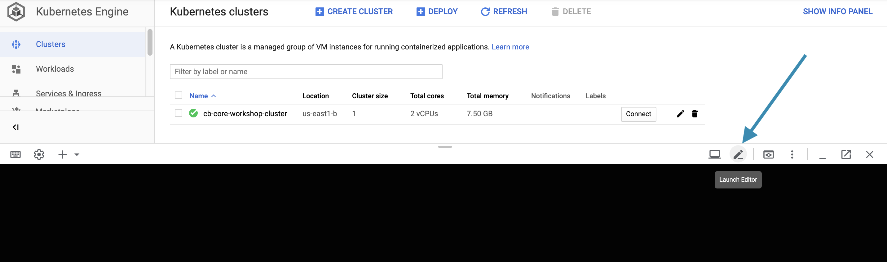
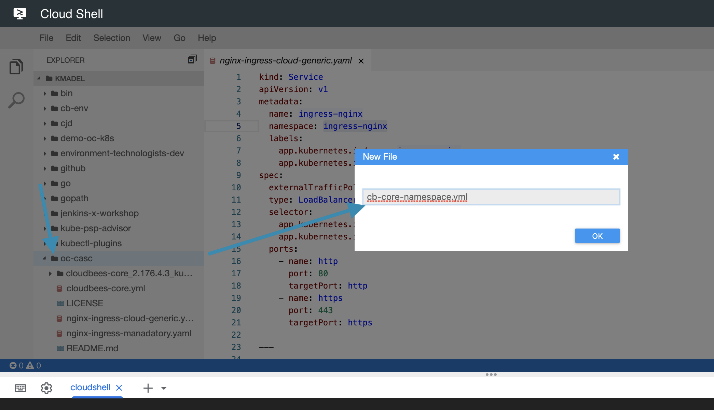

# Installing CloudBees Core on Kubernetes (GKE)

CloudBees Core on modern cloud platforms can be installed on any certified Kubernetes platform but is only verified for the platforms listed [here](https://docs.cloudbees.com/docs/cloudbees-core/latest/). For this workshop we will be installing CloudBees Core on GKE but will highlight when there are similar capabilities or lack of certain features for AWS EKS and Azure AKS. 

## Overview

- Overview of CloudBees Core for Kubernetes installation options
- Download CloudBees' Core installer
- Create necessary Kubernetes requirements for Core
- Update the yaml configuration


## Kubernetes Installation Options for CloudBees Core

There are several options for how you install CloudBees Core on Kubernetes: 

- Helm - specifically Helm 2 - with Tiller
- Helm without Tiller
- raw yaml applied with `kubectl`
- raw yaml with Kustomize

Helm 2 has some drawbacks in regards to security and stability. To achieve the most flexibility.

This workshop is intended to provide you with an understanding of everything under the hood (or at least as much as possible), and Helm hides a lot of details - as does using `sed` commands to update the CloudBees Core yaml files. But at the same time, we want to make it easy to manage the Kubernetes yaml configuration for CloudBees Core as code - to include more straightforward upgrades. So we will use Kustomize.

Once you are ready to install CloudBees Core into your own production environment you should revisit what installation approach is the best one for your organization.

## Install CloudBees Core

1. Open a Cloud Shell and connect to your workshop GKE cluster.
2. Clone the GitHub repository you created in **Getting Started**: `oc-casc` and then change directories to that new directory:
   ```
    git clone https://github.com/k8s-core-config/oc-casc.git
    cd oc-casc
   ```
3. Download the [Kubernetes NGINX Ingress Controller for GKE](https://kubernetes.github.io/ingress-nginx/deploy/#gce-gke):
   ```
    curl https://raw.githubusercontent.com/kubernetes/ingress-nginx/master/deploy/static/mandatory.yaml -o nginx-ingress-manadatory.yaml
    curl https://raw.githubusercontent.com/kubernetes/ingress-nginx/master/deploy/static/provider/cloud-generic.yaml -o nginx-ingress-cloud-generic.yaml
   ```
4. Use `kubectl` to install the NGINX Ingress Controller and verify that it is running:
   ```
    kubectl apply -f nginx-ingress-manadatory.yaml
    kubectl apply -f nginx-ingress-cloud-generic.yaml
    kubectl get pods --all-namespaces -l app.kubernetes.io/name=ingress-nginx --watch
   ```
5. You will now need to add an A record to map the sub-domain you will be using to the `ingess-nginx` Load balancer or you can use nip.io. The following command will return the external IP of the ingress-nginx load balancer:
   ```
    kubectl -n ingress-nginx get svc ingress-nginx -o jsonpath='{.status.loadBalancer.ingress[0].ip}'
   ```
   Say `104.196.106.80` was the external IP returned and the (sub)domain I am using is `k8s.cb-sa.io` (managed via Cloud DNS) and I want the CloudBees Core's URL to be `kmadel.k8s.cb-sa.io` - I can use the glcoud CLI to add an A record that maps the Core sub-domain to the external IP of the ingress-nginx load balancer:
   ```
   gcloud dns record-sets transaction start --zone="k8s-workshop-zone" --project k8s-core-workshop
   gcloud dns record-sets transaction add 104.196.106.80 --name="kmadel.k8s.cb-sa.io" \
     --ttl="30" \
     --type="A" \
     --zone="k8s-workshop-zone" \
     --project k8s-core-workshop
   gcloud dns record-sets transaction execute --zone="k8s-workshop-zone" --project k8s-core-workshop
   ```
   >NOTE: 
6. Launch the [Cloud Shell code editor](https://cloud.google.com/shell/docs/viewing-and-editing-files) by clicking on the pencil button  <p>
7. In the Cloud Shell code editor navigate to the ***oc-casc*** directory and create a new file named ***cb-core-namespace.yml**  <p>
8.  Add the following yaml to the ***cb-core-namespace.yml** file:
       ```yaml
       apiVersion: v1
       kind: Namespace
       metadata:
         name: cb-core
         labels:
           app.kubernetes.io/name: cb-core
       ```
9.  Use `kubectl` to apply the ***cb-core-namespace.yml** file:
    ```
    kubectl apply -f cb-core-namespace.yml
    ```
10. Run the following `kubectl` command to see the available StorageClasses for your cluster (note that `sc` is shorthand for `storageclass`):
    ```
    kubectl get sc
    ```
11. Google automatically creates a `standard` Storage class, but it is for slower magnetic storage and we want faster SSD storage for CloudBees Core Persistent Volumes. In the Cloud Shell code editor create a file named ***ssd-storageclass.yml*** in the ***oc-casc*** directory with the following contents:
    ```yaml
    apiVersion: storage.k8s.io/v1
    kind: StorageClass
    metadata:
      name: ssd
    provisioner: kubernetes.io/gce-pd
    allowVolumeExpansion: true
    parameters:
      type: pd-ssd
    ```
    The important things to note is the `type` parameter set to `pd-ssd` and `allowVolumeExpansion` set to true - this will allow us to expand the volumes of Managed Masters from Operations Center ([CloudBees Doc](https://docs.cloudbees.com/docs/cloudbees-core/latest/gke-install-guide/installing-gke-using-installer#_creating_a_new_ssd_persistent_storageclass)). 
12. Use `kubectl` to apply the ***ssd-storageclass.yml*** file
13. Create a directory named ***kustomize***:
   ```
    mkdir kustomize
   ```
16. Download the [latest CloudBees' Core installer](https://downloads.cloudbees.com/cloudbees-core/cloud/latest/), verify , unarchive it into the `oc-casc` directory, delete the archive and copy the ***cloudbees-core.yml*** file into the ***kustomize*** directory we created above:
   ```
    curl -O https://downloads.cloudbees.com/cloudbees-core/cloud/latest/cloudbees-core_2.176.4.3_kubernetes.tgz 
    curl -O https://downloads.cloudbees.com/cloudbees-core/cloud/latest/cloudbees-core_2.176.4.3_kubernetes.tgz.sha256
    export INSTALLER=cloudbees-core_2.176.4.3_kubernetes.tgz
    sha256sum -c $INSTALLER.sha256
    tar xzvf $INSTALLER
    rm cloudbees-core_2.176.4.3_kubernetes.tg*
    cp ./cloudbees-core_2.176.4.3_kubernetes/cloudbees-core.yml ./kustomize
   ```
17. Open the ***cloudbees-core.yml*** file in the ***kustomize*** directory in the Cloud Shell code editor and update the `data.location.groovy` of the `cjoc-configure-jenkins-groovy` ConfigMap by replacing ***cloudbees-core.example*** with the sub-domain you are using for the workshop:
    ```yaml
    apiVersion: v1
    kind: ConfigMap
    metadata:
      name: cjoc-configure-jenkins-groovy
    ....
    data:
      location.groovy: |
        hudson.ExtensionList.lookupSingleton(com.cloudbees.jenkins.support.impl.cloudbees.TcpSlaveAgentListenerMonitor.class).disable(true)
        jenkins.model.JenkinsLocationConfiguration.get().setUrl("http://k8sworkshop.cb-sa.io/cjoc")
    ```
18. Create a Kustomize patch file - named ***set-storageclass.yml*** in the ***kustomize*** directory - to set the StorageClass to be used for the `cjoc` StatefulSet and override the `storage` size from `20Gi` to `30Gi`:
    ```yaml
    apiVersion: "apps/v1"
    kind: "StatefulSet"
    metadata:
        name: cjoc
    spec:
        volumeClaimTemplates:
        - metadata:
            name: jenkins-home
        spec:
            accessModes:
            - "ReadWriteOnce"
            storageClassName: ssd
            resources:
            requests:
                storage: "30Gi"
    ```
19. Create another Kustomize patch file - named ***set-ingress-host.yml*** in the ***kustomize*** directory - to override the `host` value for the `cjoc` Ingress:
    ```yaml
    apiVersion: extensions/v1beta1
    kind: Ingress
    metadata:
      name: cjoc
    spec:
      rules:
      - host: "k8sworkshop.cb-sa.io"
    ```
20. Create a Kustomize file named ***kustomization.yml*** in the ***kustomize*** directory to apply the `cb-core` Namespace to all the Kubernetes Resources defined in the ***cloudbees-core.yml*** file, patch the `cjoc` `StatefulSet` to set the `StorageClass` and patch the `cjoc` `Ingress` resource with our sub-domain
21. Add the following yaml to the ***kustomization.yml** file:
    ```yaml
    namespace: cb-core
    resources:
    - cloudbees-core.yml
    patchesStrategicMerge:
    - set-storageclass.yml
    - set-ingress-host.yml
    ```
22. Use `kubectl` to apply everything ([as of version 1.14 Kustomize is integrated `kubectl`](https://kubernetes.io/docs/tasks/manage-kubernetes-objects/kustomization/)) - the `-k` flag allows specifying a Kustomize directory - and then check on the rollout status of the `cjoc` `StatefulSet`:
    ```yaml
    kubectl apply -k ./kustomize
    kubectl -n cb-core rollout status sts cjoc
    ```
23. Once the `jenkins` container of the `cjoc-o` Pod is running you can retrieve the temporary Jenkins admin password with the following command:
    ```
    kubectl -n cb-core exec cjoc-0 -- cat /var/jenkins_home/secrets/initialAdminPassword
    ```
    >NOTE: You do not need to specify the Pod `container` using the `-c` flag because the `cjoc-0` Pod only has one container.
24.  Copy the `initialAdminPassword` value goto your sub-domain and log in with the password.


## Lab Summary
We installed CloudBees Core on GKE.

