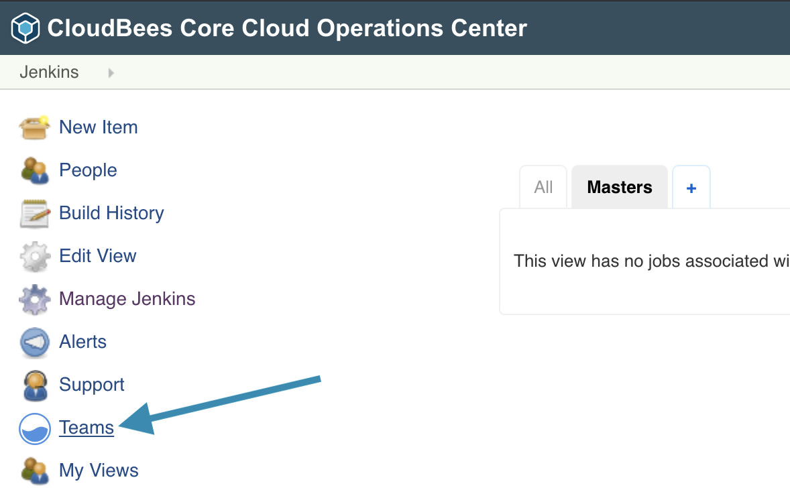
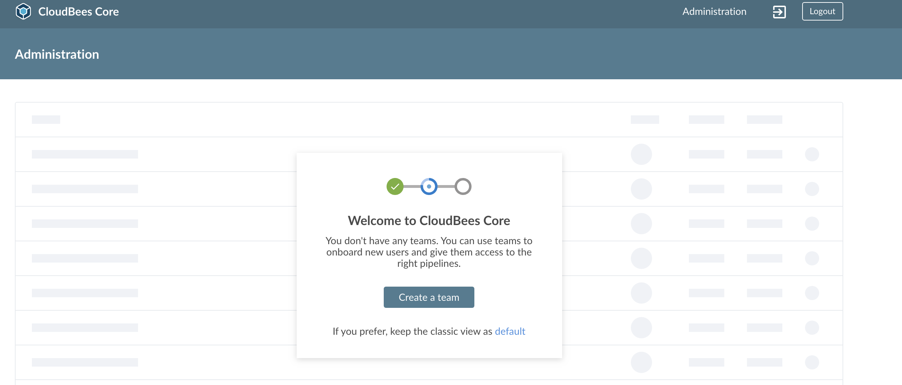

# Managed Master Provisioning and Configuration 

The dynamic provisioning of Managed Master by Operations Center is an important feature for managing many Jenkins Masters at scale with CloudBees Core on Kubernetes. The ability to quickly and easily provision two pizza team Managed Masters - that are also easier to manage than standalone OSS Jenkins Masters - provides enhance stability, security and better performance per team.

## Provisioning Masters
There are two types of Managed Masters for CloudBees Core:

1. Regular Managed Masters - provides more customization at creation time and the use of a more sophisticated RBAC model to include folder level permissions
2. Team Masters - provides a new UX and simplified RBAC, also supports provisioning via a CLI

Both types of Masters can be provisioned through the CloudBees Core Operations Center UI and programmatically via Groovy scripts or a CLI.

We will start with provisioning a Team Master via the UI:

1. If not in CloudBees Team UI, click on the Teams link in the left menu <p>
2. Next, click on the Create team button in the center of your screen <p>
3. Fill out the **New Team** creation form:
   1. Provide a name for your team in **Name this team** - I will call mine ***tiger*** and then click the **Next** button
   2. **Choose an icon for this team** and **Color**, and then click the **Next** button
   3. For **Add people to this team** just stick with the default of adding your admin user as **Team Admin** and then click the **Next** button
   4. For **Select team master creation recipe** select the default **Basic** and then click the **Create team** button
4. It will take a few minutes for your new Team Master to be provisioned. If you open up the GCP console for **Kubernetes Engine** > **Workloads** you should see your new Team Master listed as a **Stateful Set** <p>
5. Click on the **Name** of you Team Master - the name for mine is **teams-tiger** - and under **Managed pods** you will see that there are ***No matching pods***
6. We could use `kubectl` to see what is going on, but we can also use the GCP console - at the top of the **Stateful set details** screen click on the **Events** tab and you should see a **FailedCreate** message referring to pod security polices <p>
   >NOTE: You will also see an error message referring to ***evaluating the ingress spec*** - we will explain this and fix it in a later section of this lab.
7. Next, if you look at the **YAML** tab and scroll down to where the `serviceAccount` is specified, you will see that the Team Master was provisioned with the `jenkins` ServiceAccount <p>
8. In the PSP lab we applied the `cb-resticted` PSP to the `cjoc` ServiceAccount but not the `jenkins` ServiceAccount - so will update the `restricted-psp-role` `RoleBinding` in the ***cb-restricted-psp.yml*** file in the ***kustomize*** directory to add the `jenkins` ServiceAccount:
   ```yaml
   ---
   apiVersion: rbac.authorization.k8s.io/v1
   kind: RoleBinding
   metadata:
     name: restricted-psp-role
   roleRef:
     apiGroup: rbac.authorization.k8s.io
     kind: ClusterRole
     name: restricted-psp-cluster-role
   subjects:
   - kind: ServiceAccount
     name: cjoc
     namespace: cb-core
   - kind: ServiceAccount
     name: jenkins
     namespace: cb-core
   ```
   Then apply it with `kubectl`:
   ```
   kubectl apply -k ./kustomize
   ```
9.  The `teams-tiger-0` Pod will now start and if you look at the **Pod details** screen note that the **Annotations** includes `kubernetes.io/psp: cb-restricted`. <p>
10. You may have to **Acknowledge error** and **Restart** your Team Master

## Nginx Ingress Issues on GKE

GKE provides its own ingress solution but it has some limitations that the Nginx ingress does not. Also, if you look at the **Services & Ingress** dashboard in the GKE console you will notice that the **teams-tiger** `Ingress` has a **Status** of ***Creating ingress** even thought it has been created and is working fine. <p>
TODO Update to use the Managed Master configuration > Provisioning > Advanced configuration - then update CJOC to affect all future Managed Masters

1. From the **classic UI** of Operations Center hover over the link for your Team Master and click on the small black triangle to bring up the Managed Master context menu. <p>
2. Click on **Configure** - this will bring up the same configuration screen you would have seen if you created a ***regular*** Managed Master instead of a Team Master
3. Under the **Provisioning** configuration scroll down to the **YAML** input under **Advanced configuration** and enter the following Kubernetes patch for the Team Master's `Ingress` resource.
  ```yaml
   ---
   kind: Ingress
   metadata:
     annotations:
       kubernetes.io/ingress.class: "nginx"
   ```
   This patch will tell GKE that this is an **nginx** `Ingress` and GKE will no longer assume that it is a GKE `Ingress` that doesn't support `ClusterIP`.
   Once you insert that into the left text area input for the **YAML** configuration and click outside of it, should see the `Ingress` resource on the right updated to reflect the patch. <p>
4. Click the **Save** button.
5. In order for the patch to be applied we must **Restart** the Team Master <p>
6. Once it has restarted check the GKE console, you should see that the `Ingress` for the Team Master has a **Status** of ***Ok***.

Now we don't want to have to add that `Ingress` patch manually to every Managed Master we provision (especially Team Masters since we can't do it until after they are created). Operations Center allows you to specify Kubernetes YAML patches that will be applied to all provisioned Managed Masters - but it will only be applied to newly provisioned Managed Masters, not Managed Masters that have already been provisioned.

1. Click on **Manage Jenkins** in the left menu of CloudBees Core Operations Center
2. Click on **Configure System**
3. Scroll down to and click the **Advanced** button under **Kubernetes Master Provisioning**
4. Scroll down to the **YAML** configuration
5. We are able to place patches in the left text area to be applied to all provisioned Masters. We will add the following patch to update all the Managed Master `Ingress` resources:
   ```yaml
   ---
   kind: Ingress
   metadata:
     annotations:
       kubernetes.io/ingress.class: "nginx"
   ```
   <p>
6. Click the **Save** button to apply the updated **YAML** **Kubernetes Master Provisioning** configuration.

## Jenkins Configuration as Code with CloudBees Configuration Bundles

Configuration as code is a best practice for managing Jenkins at scale. Similar to what we have been doing so far for the Kubernetes configuration for Core.


## JCasC at Scale

Use `yq` to merge a based JCasC yaml file with a Managed Master specific JCasC yaml.