# Managed Master Provisioning and Configuration 

The dynamic provisioning of Managed Master by Operations Center is an important feature for managing many Jenkins Masters at scale with CloudBees Core on Kubernetes. The ability to quickly and easily provision two pizza team Managed Masters - that are also easier to manage than standalone OSS Jenkins Masters - provides enhanced stability, security and better performance per team.

## Provisioning Masters
There are two types of Managed Masters for CloudBees Core:

1. Regular Managed Masters - provides more customization at creation time and the use of a more sophisticated RBAC model to include folder level permissions
2. Team Masters - provides a new UX and simplified RBAC, also supports provisioning via a CLI

Both types of Masters can be provisioned through the CloudBees Core Operations Center UI and programmatically via Groovy scripts or a CLI.

We will start with provisioning a regular Managed Master via the UI:

1. Login to CloudBees Core Operations Center and click on the **Teams** link in the left navigation menu - this will create a **Teams** folder if it doesn't already exist and then click on the square button with the arrow next to the **Logout** button in the top right of the screen to exit back to the *classic UI* <p>
2. Navigate to the **Teams** folder by going to the **All** view and then click on the **Teams** folder. <p>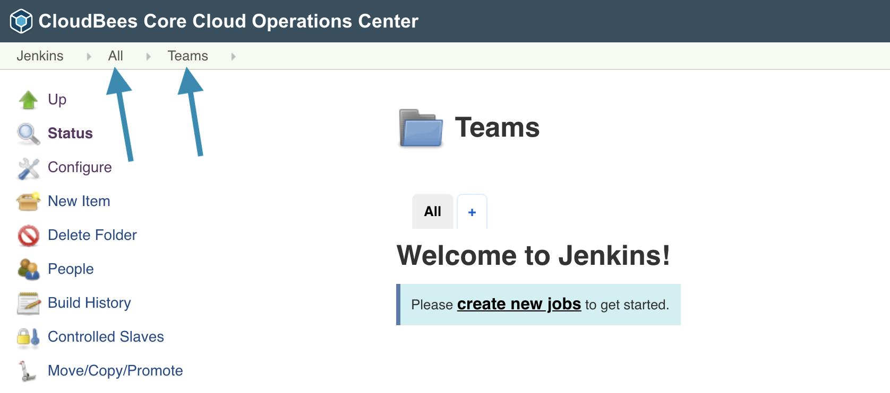
3. In the left menu click on the **New Item** link, **Enter an item name** - I will use ***test*** -, select **Managed Master** and then click the **OK** button. <p>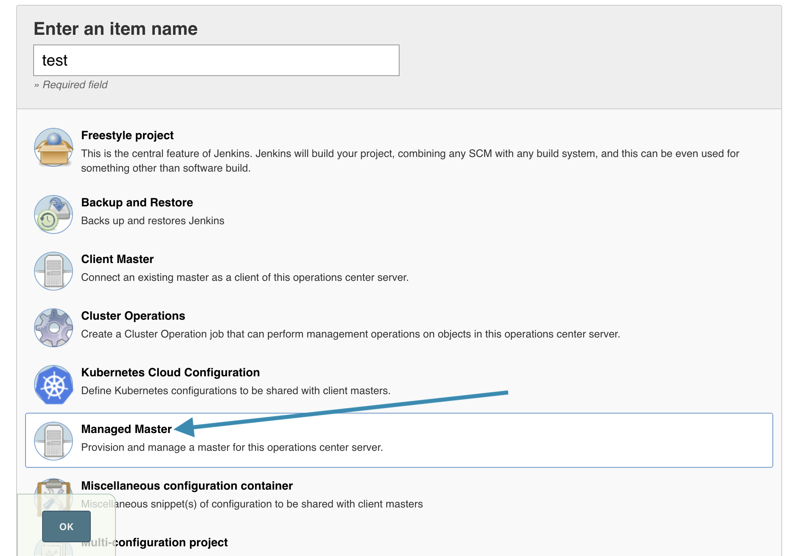
4. The Managed Master configuration form provides a number of inputs, but for now we are just going to accept the defaults and click the **Save** button. <p>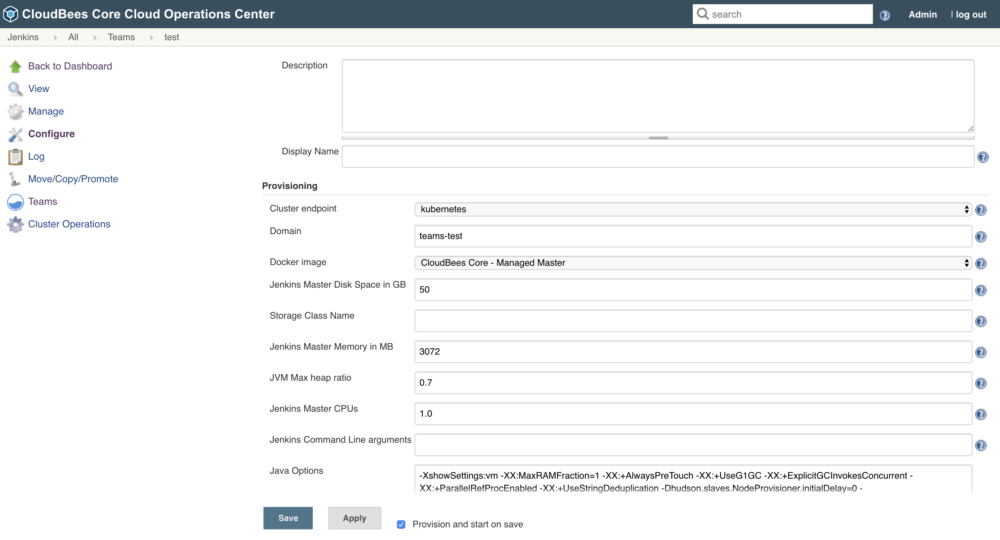
5. It will take a few minutes for your new Managed Master to be provisioned. However, if you open up the GCP console for **Kubernetes Engine** > **Workloads** you should see your new Managed Master listed as a **Stateful Set** with a **Pods** value of **0/1** - meaning the desired state is 1 pod but there are currently 0 <p>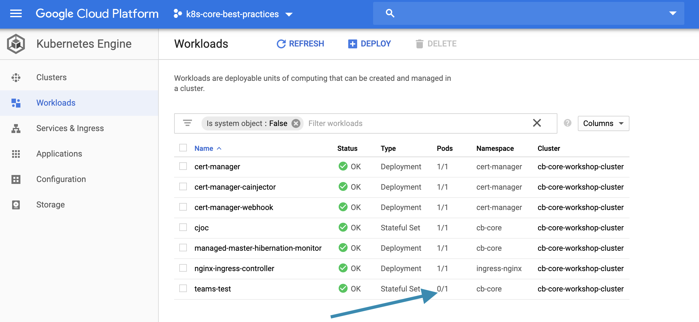
6. In the GCP console, click on the **Name** of you Managed Master - the name for mine is **teams-test** - and under **Managed pods** you will see that there are ***No matching pods***
7. We could use `kubectl` to see what is going on, but we can also use the GCP console - at the top of the **Stateful set details** screen click on the **Events** tab and you should see a **FailedCreate** message referring to pod security polices <p>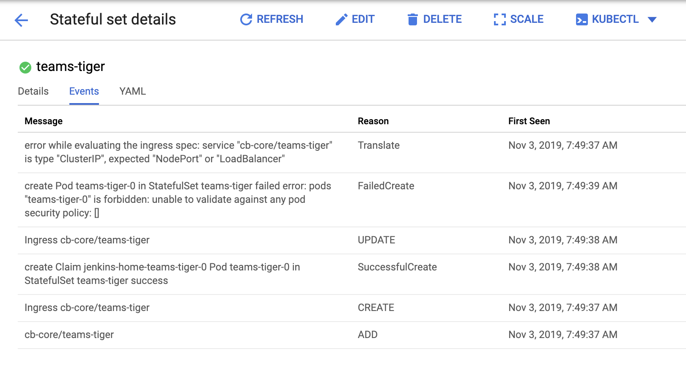
   >NOTE: You will also see an error message referring to ***evaluating the ingress spec*** - we will explain this and fix it in a later section of this lab.
8. Next, if you look at the **YAML** tab and scroll down to where the `serviceAccount` is specified, you will see that the Managed Master was provisioned with the `jenkins` ServiceAccount <p>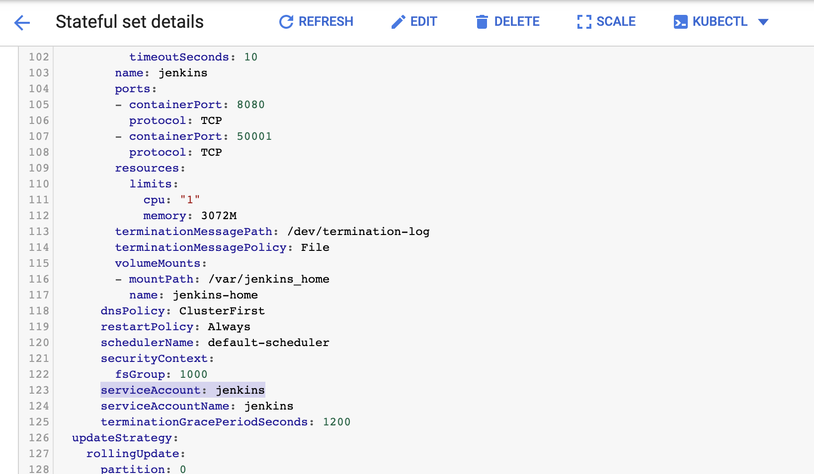
   >NOTE: If no `serviceAccount` is specified in the Kubernetes manifest then that means the `default` `ServiceAccount` was used.
9. In the [PSP lab](../pod-security-policies/psp.md) we applied the `cb-resticted` PSP to the `cjoc` ServiceAccount but not the `jenkins` ServiceAccount - so will update the `restricted-psp-role` `RoleBinding` in the ***cb-restricted-psp.yml*** file in the ***kustomize*** directory to add the `jenkins` ServiceAccount:
   ```yaml
   ---
   apiVersion: rbac.authorization.k8s.io/v1
   kind: RoleBinding
   metadata:
     name: restricted-psp-role
   roleRef:
     apiGroup: rbac.authorization.k8s.io
     kind: ClusterRole
     name: restricted-psp-cluster-role
   subjects:
   - kind: ServiceAccount
     name: cjoc
     namespace: cb-core
   - kind: ServiceAccount
     name: jenkins
     namespace: cb-core
   ```
   Then apply it with `kubectl`:
   ```
   kubectl apply -k ./kustomize
   ```
   Remember, in order for any Pod to be able to start with PSPs enable, there must be an applicable PSP bound to the `ServiceAccount`.
10. The `teams-tests-0` Pod will now start (it may take a couple of minutes as the cluster may need to scale up) and if you look at the **Pod details** screen note that the **Annotations** includes `kubernetes.io/psp: cb-restricted`. <p>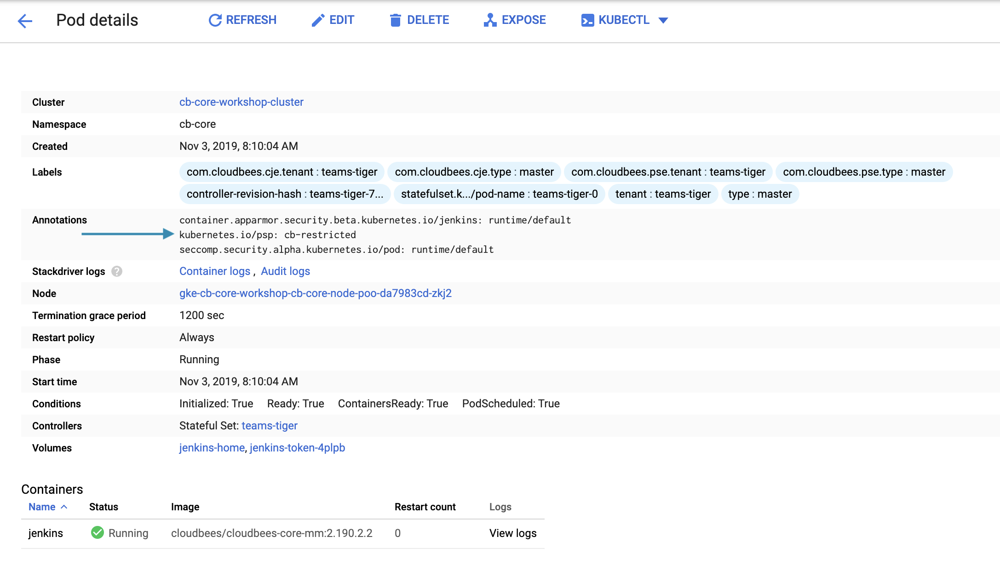
11. You may have to **Acknowledge error** in Operations Center and **Restart** your Managed Master. <p>
12. Click on the link for your Managed Master (goto your Managed Master URL - mine is https://kmadel.cb-sa.io/teams-test/) and you should see the set-up wizard, click on **Install suggested plugins**. <p>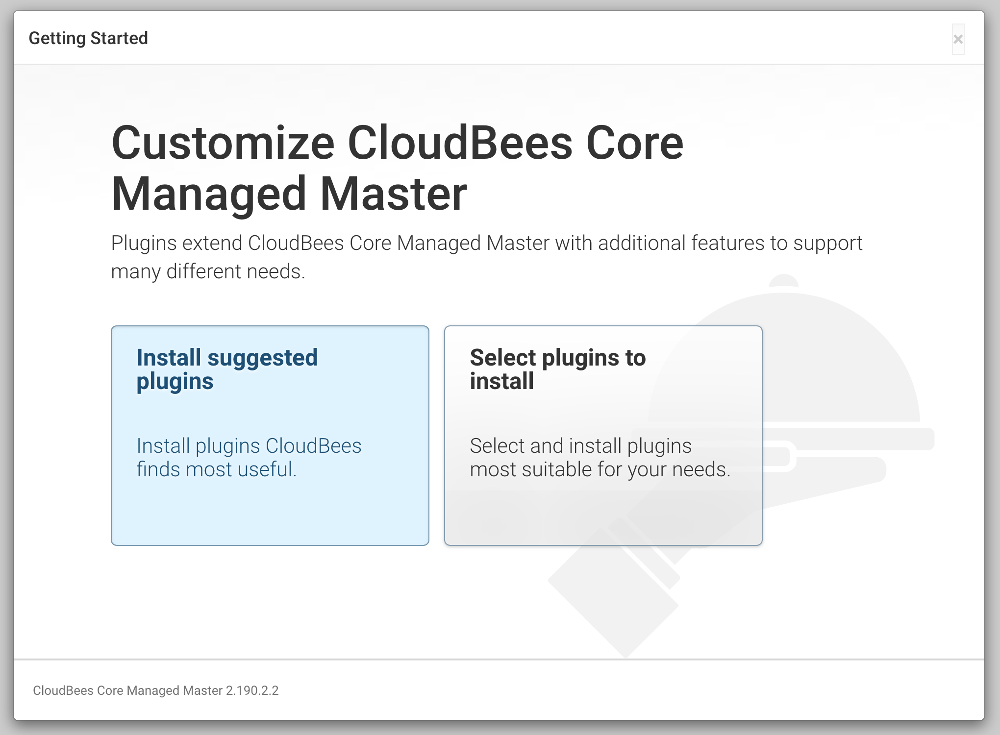
13. The CloudBees suggest plugins will be installed and once complete will take you to the **CloudBees Core Managed Master is ready!** screen, click on the **Start using CloudBees Core Managed Master** button.
14. You now have a Managed Master connected to your CloudBees Core Operations Center.

## Nginx Ingress Issues on GKE

GKE provides its own ingress solution but it has some limitations that the Nginx ingress does not. Also, if you look under the **Ingresses** tab in the **Services & Ingress** dashboard of the GKE console you will notice that the **teams-test** `Ingress` has a **Status** of ***Creating ingress** even though it has been created and the Managed Master is accessible - meaning the ingress is working. <p>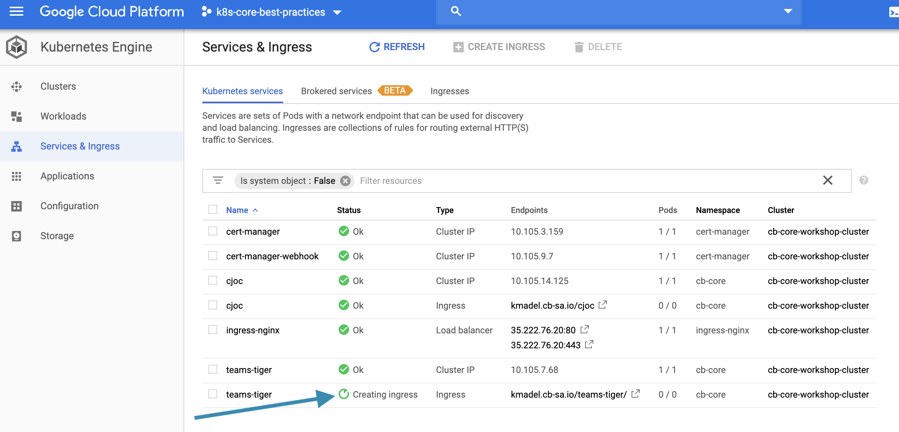

1. From the **classic UI** of Operations Center hover over the link for your Managed Master and click on the small black triangle to bring up the Managed Master context menu. <p>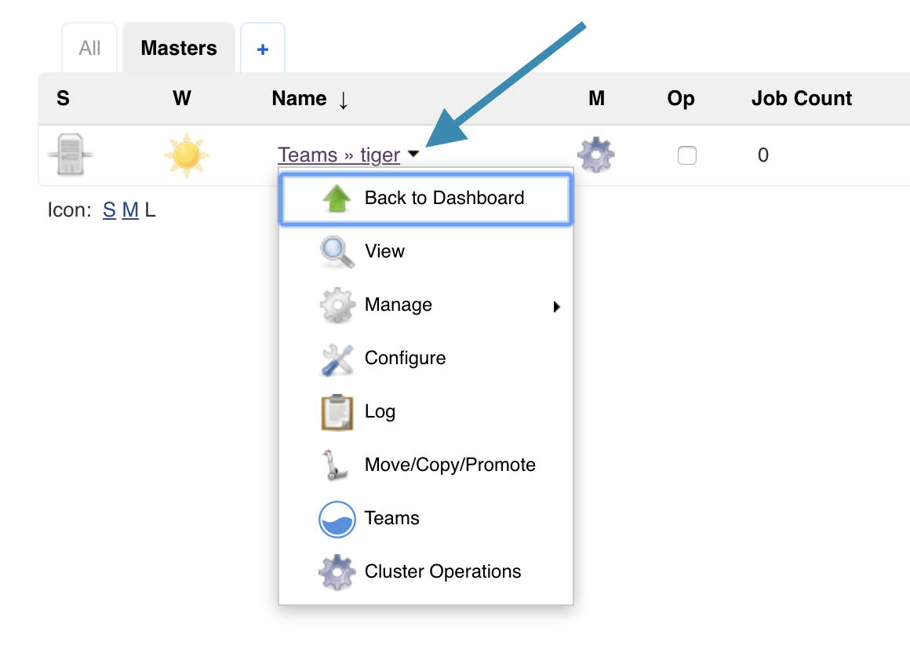
2. Click on **Configure** - this will bring up the same configuration screen used when creating the Managed Master.
3. Under the **Provisioning** configuration scroll down to the **YAML** input under **Advanced configuration** and enter the following Kubernetes patch for the Managed Master's `Ingress` resource.
  ```yaml
   ---
   kind: Ingress
   metadata:
     annotations:
       kubernetes.io/ingress.class: "nginx"
   ```
   This patch will tell GKE that this is an **nginx** `Ingress` and GKE will no longer assume that it is a GKE `Ingress` that doesn't support `ClusterIP`.
   Once you insert that into the left text area input for the **YAML** configuration and click outside of it, you should see the `Ingress` resource on the right updated to reflect the patch. <p>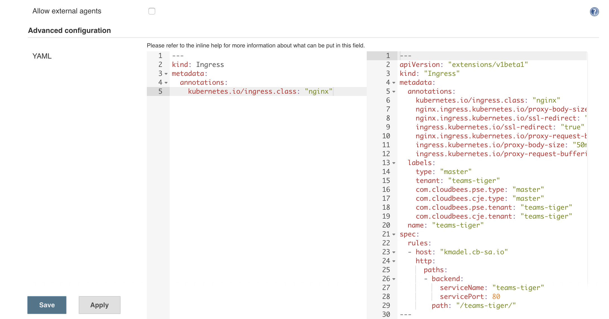
4. Click the **Save** button.
5. In order for the patch to be applied we must **Restart** the Managed Master <p>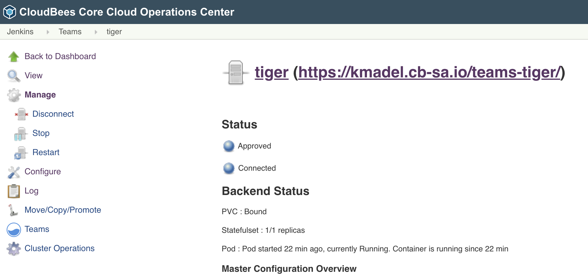
6. Once it has restarted check the GKE console, you should see that the `Ingress` for your Managed Master has a **Status** of ***Ok***. <p>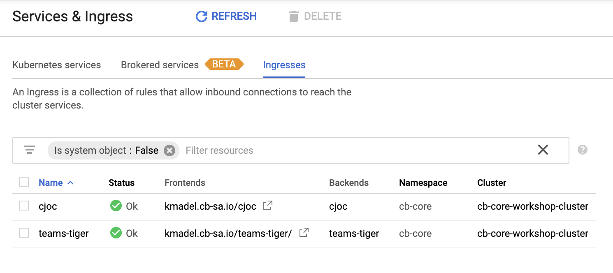

Now we don't want to have to add that `Ingress` patch manually to every Managed Master we provision (especially Team Masters since we can't do it until after they are created). Operations Center allows you to specify Kubernetes YAML patches that will be applied to all provisioned Managed Masters - but it will only be applied to newly provisioned Managed Masters, not Managed Masters that have already been provisioned.

1. Click on **Manage Jenkins** in the left menu of CloudBees Core Operations Center
2. Click on **Configure System**
3. Scroll down to and click the **Advanced** button under **Kubernetes Master Provisioning**
4. Scroll down to the **YAML** configuration
5. We are able to place patches in the left text area to be applied to all provisioned Masters. We will add the following patch to update all the Managed Master `Ingress` resources:
   ```yaml
   ---
   kind: Ingress
   metadata:
     annotations:
       kubernetes.io/ingress.class: "nginx"
   ```
   <p>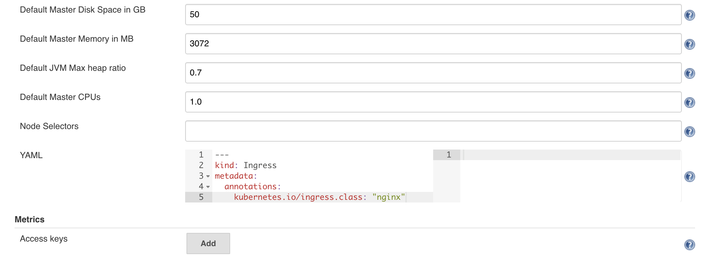
6. Click the **Save** button to apply the updated **YAML** **Kubernetes Master Provisioning** configuration.

## Persistent Storage

Persistent storage.
Affinity.

## Lab Summary
We provisioned a Managed Master and saw how we can manage provisioning configuration in Operations Center for all Managed Masters. In the [next lab](../casc-core/casc-core.md) we will look at configuration-as-code for Operations Center and Managed Masters.

## NOT RELEASED Jenkins Configuration as Code with CloudBees Configuration Bundles

Configuration as code is a best practice for managing Jenkins at scale. Similar to what we have been doing so far for the Kubernetes configuration for Core.

>NOTE: The CloudBees Configuration Bundle is currently in Technical Preview and should not be used in a production environment.

We need to create a directory for each Managed Masters with the following files and then copy that directory into the ***jcasc-bundles-store*** directory in the Jenkins home directory of Operations Center:

1. `bundle.yaml` - This file is an index file that describes the bundle, and references the other files in the bundle.
2. `jenkins.yaml` - This file contains the Jenkins configuration, as defined by the [JCasC plugin](https://github.com/jenkinsci/configuration-as-code-plugin).
3. `plugins.yaml` - This file contains a list of all the plugins that should be installed on the master.
4. `plugin-catalog.yaml` - This file contains the plugin catalog definitions that should be created on the master.

Now will create a Configuration Bundle for our Team Master:

1. Make a new ***jcasc-bundles-store*** directory under the ***oc-casc** directory in the GCP Cloud Shell:
   ```
   mkdir jcasc-bundles-store
   ```
2. Within that directory make a directory with the same name as your Team Mastes (to include the ***teams** folder portion of the name):
   ```
   mkdir jcasc-bundles-store/teams-tiger
   ```
3. Create the bundle files within the Team Master folder:
4. Copy to the Operations Center ***jcasc-bundles-store*** directory with `kubectl`:
5. Restart the Team Master

